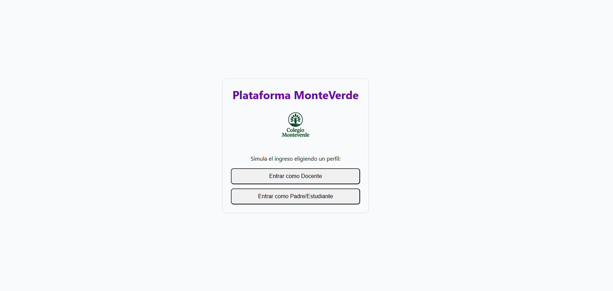
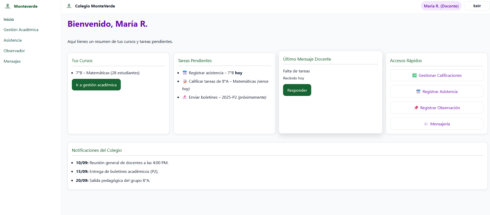
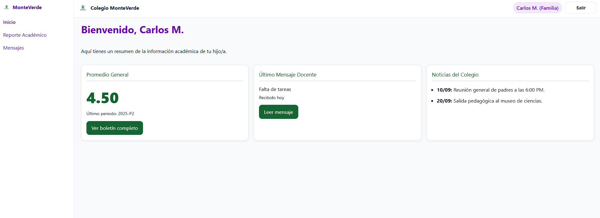

#  Plataforma MonteVerde – Frontend en React

Este repositorio contiene la migración del **Prototipo MonteVerde** a **React**.  
El objetivo es desarrollar una plataforma web de gestión académica para docentes, estudiantes y familias, con navegación fluida, consumo de APIs y seguridad mediante JWT en etapas futuras.

---

##  Estado del Proyecto

✅ Migración inicial a React con Vite  
✅ Rutas configuradas con React Router  
✅ Dashboards para perfiles **Docente** y **Familia**  
✅ Simulación de datos con mocks (`apiFake`)  
✅ Componentes reutilizables (Tablas, Cards, Header, Selects)  
🔜 Conexión a **JSON Server** para datos reales  
🔜 Autenticación y seguridad con JWT  
🔜 Integración con API propia (backend)

---

### Pantalla de Login

### Dashboard Docente

### Dashboard Familia

---

##  Tecnologías Utilizadas

- [React](https://react.dev/) – Librería de UI
- [Vite](https://vitejs.dev/) – Bundler rápido
- [React Router DOM](https://reactrouter.com/) – Ruteo de páginas
- CSS puro – Estilos globales y utilidades
- JSON Mock (`apiFake`) – Simulación de datos

---

##  Instalación y Uso

Clonar este repositorio:

git clone https://github.com/guiooscar/monteverde-frontend.git
cd monteverde-frontend

Instalar dependencias:

npm install

Ejecutar en desarrollo:

npm run dev

El proyecto se abrirá en http://localhost:5173

---
##  Estructura del Proyecto

src/
 ├─ components/     # Componentes reutilizables (Card, Tabla, Header, etc.)
 ├─ layouts/        # Layouts principales (Docente y Familia)
 ├─ pages/          # Páginas por perfil docente, familia y login (, Registro, Reporte, etc.)
 ├─ mocks/          # Datos simulados en JSON
 ├─ services/       # apiFake para consumir mocks
 ├─ styles/         # Estilos globales
 ├─ App.jsx         # Definición de rutas
 └─ main.jsx        # Punto de entrada

##  Estructura del Proyecto

- Login simulado: permite ingresar como Docente o Familia.

- Docente:

    Registro de Calificaciones

    Control de Asistencia

    Observador del Alumno

    Dashboard con accesos rápidos y notificaciones

- Familia:

    Reporte Académico (con filtro por periodo)

    Dashboard con promedio general, mensajes y noticias